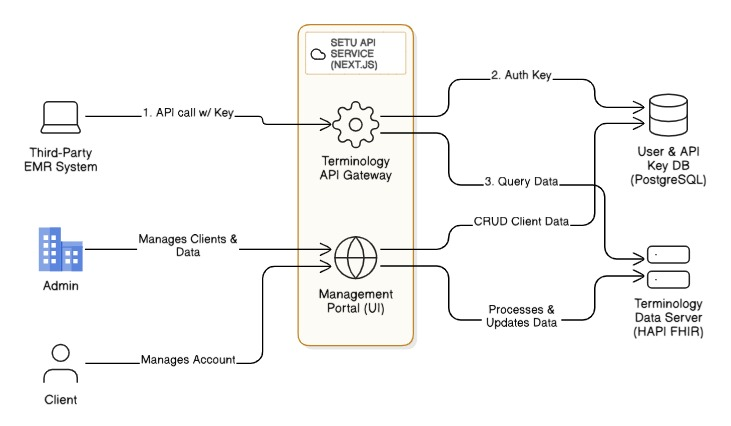

i already have ## Architecture

### System Diagram
```
┌────────────────────────────┐        ┌──────────────────────────────┐        ┌──────────────────────────────┐        ┌────────────────────────────┐
│        EMR Frontend        │  HTTPS │         EMR Backend          │  HTTPS │          Main Backend         │  HTTP  │        HAPI FHIR R4         │
│ React + Vite (5173)        │◄──────►│ Express Proxy (5000)         │◄──────►│ Next.js API (3000)            │◄──────►│ Docker Compose (8080)       │
│ Auth headers + API key     │        │ Validates X-API-Key + JWT    │        │ $lookup/$translate via HAPI  │        │ FHIR CodeSystem/ConceptMap  │
└────────────────────────────┘        └──────────────────────────────┘        └──────────────────────────────┘        └────────────────────────────┘
```

### Components and Roles
- EMR Frontend (`EMR/emr-frontend-clean`): React UI for clinicians; posts `query` and optional `patientId` to EMR backend; displays mappings and FHIR resource summaries.
- EMR Backend (`EMR/terminology-service`): Express proxy that enforces `X-API-Key` and `Authorization: Bearer <ABHA JWT>`, forwards to main backend with its own API key, transforms responses for the UI, and exposes health.
- Main Backend (Next.js app `app/api/terminology/search/route.ts`): Core logic. Authenticates API client, verifies ABHA JWT, runs terminology operations through HAPI, builds raw mapping and FHIR Condition, and logs audit events.
- HAPI FHIR (`hapi-loader` + Docker): Terminology server storing NAMASTE `CodeSystem` and NAMASTE→ICD-11 `ConceptMap`, supporting `$lookup`, `$translate`, `$validate-code`.

### Data Flow
1. Clinician types a term in EMR Frontend.
2. Frontend sends POST `/api/search` with `X-API-Key` and `Authorization` to EMR Backend.
3. EMR Backend validates headers and forwards to Main Backend `/api/terminology/search` with its `MAIN_BACKEND_API_KEY` and the same Bearer token.
4. Main Backend authenticates client (header `X-API-Key`), verifies ABHA JWT scope `terminology/search.read`, parses body.
5. Calls HAPI `$lookup` for NAMASTE and `$translate` to ICD-11; may fallback to CSV if needed.
6. Builds FHIR `Condition` with dual codings; logs `AuditEvent`.
7. Returns `rawMapping` + `fhir` to EMR Backend → transforms to UI-friendly shape → Frontend renders.

### Important Files
- `app/api/terminology/search/route.ts` — ABHA JWT validation, client auth, FHIR/Audit building.
- `lib/hapiClient.ts`, `lib/terminologyHapi.ts`, `lib/terminology.ts` — HAPI and CSV logic.
- `EMR/terminology-service/src/app.js` — Express proxy, health checks, forwarding logic.
- `hapi-loader/scripts` — CSV→FHIR and loading to HAPI.

### Ports & Dependencies
- 8080 HAPI → must be up before Main Backend
- 3000 Main Backend → depends on HAPI
- 5000 EMR Backend → depends on Main Backend
- 5173 Frontend → depends on EMR Backend

<br><br>


